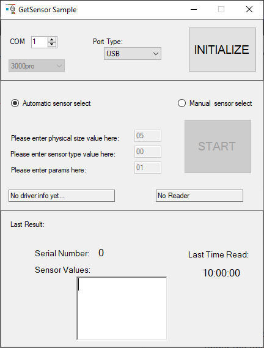

# Native driver DOC sample codes for TELID®200 sensor transponders
This sample code is for handling **TELID®200** sensor transponders on Windows devices using a Micro-Sensys RFID reader

> For details on DOC communication check [Useful Links](#Useful-Links) 

## Requirements
* .NET Framework IDE (Visual Studio 2017)
* Micro-Sensys RFID reader
* TELID®200 sensor transponders

## Implementation
This code shows how to use **iiddrv30_pro.dll** class to communicate with a device running on SPC mode. 
Using this code the communication port can be open/closed. Once the communication with RFID reader is established, a Thread can be started to cyclically search for TELID®200 and read current measurement value.

> Library information is available under API documentation. See [Useful Links](#Useful-Links)

## Steps
Import the project into your IDE and check the communication port name for the RFID reader (for example *COM3*) and fill the name into the code.
For some samples the available devices are automatically detected. 

 1. Select the device you wish to connect to and open the communication port. Once the connect process finishes, if the device is connected the START button will be enabled.
 2. Use *START* button to start the read Thread. The library will automatically detect the TELID® type and show the measurements

## Useful Links
* [Native library and API documentation](https://www.microsensys.de/downloads/DevSamples/Libraries/UNIX/microsensysRFID%20-%20jar%20library/)
* Check what is possible using our iID®DEMOsoft (section SENSORdemo) for PC! Download it using [this link](https://www.microsensys.de/downloads/CDContent/Install/iID%c2%ae%20DEMOsoft.zip)
* GitHub *documentation* repository: [Micro-Sensys/documentation](https://github.com/Micro-Sensys/documentation)
	* [communication-modes/doc](https://github.com/Micro-Sensys/documentation/tree/master/communication-modes/doc)

## Contact

* For coding questions or questions about this sample code, you can use [support@microsensys.de](mailto:support@microsensys.de)
* For general questions about the company or our devices, you can contact us using [info@microsensys.de](mailto:info@microsensys.de)

## Authors

* **Victor Garcia** - *Initial work* - [MICS-VGarcia](https://github.com/MICS-VGarcia/)
